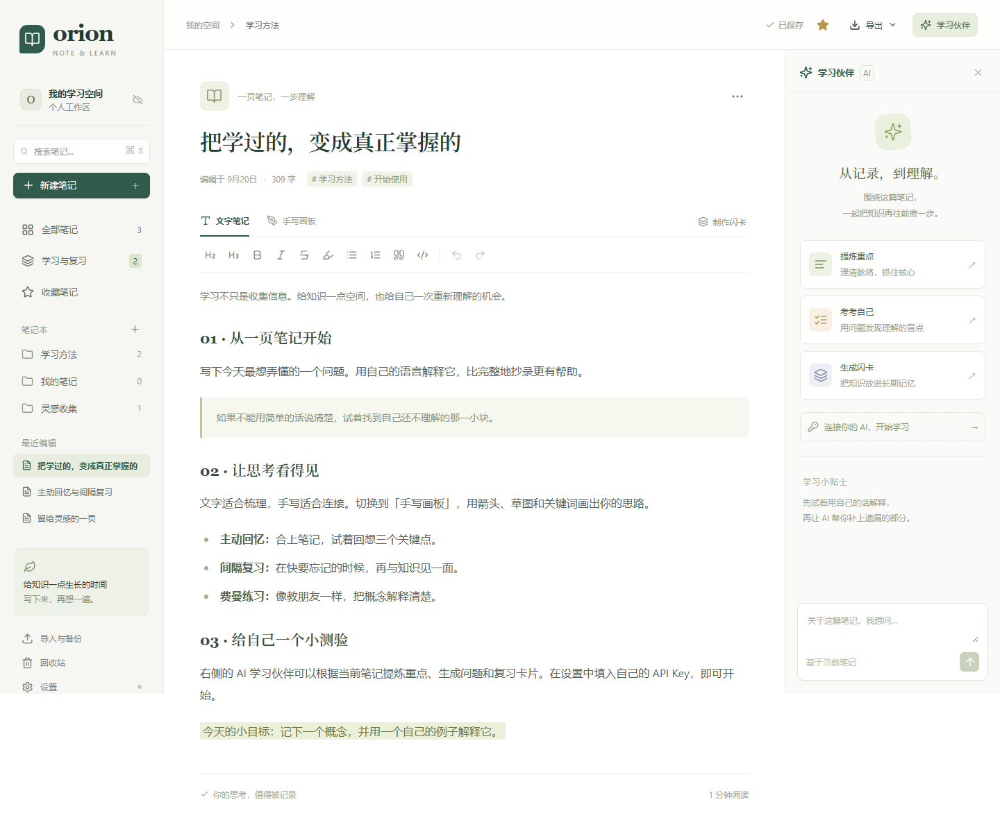

# Orion Note Learn

**写下想法，让知识留下。**

Orion 是一款本地优先的开源笔记与学习工具，把富文本、手写画板、AI 整理和间隔复习放在同一个安静的工作台里。面向电脑、iPad 和手机浏览器，默认中文。



## 已实现

- 富文本笔记：标题、加粗、斜体、列表、引用、代码、高亮、撤销与重做。
- 笔记本与标签、全文搜索、收藏、回收站、恢复与确认永久删除。
- 手写画板：鼠标、触摸、触笔，多种墨色与粗细、整笔橡皮、撤销与重做、仅触笔模式、SVG 下载。
- AI 学习伙伴：重点总结、主动回忆问题、问答闪卡、围绕当前笔记提问；结果可追加到笔记。
- 自带 API Key：DeepSeek、OpenAI、OpenRouter，以及管理员允许的 OpenAI 兼容 HTTPS 接口。
- 手动制作闪卡、答案翻面、自评掌握程度、持久化复习时间。再想一想：10 分钟；基本掌握：至少 1 天并逐步翻倍；很有把握：至少 4 天并逐步增加。
- IndexedDB 自动保存，明确的保存状态与失败提示。
- 可选账户与跨设备云同步：Cloudflare Worker + D1 保存笔记数据，R2 保存粘贴图片；离线时继续本地写作。
- PDF 下载（包括中文及手写内容）、Markdown、TXT、SVG，以及完整 JSON 备份与恢复。
- 响应式布局、键盘操作、原生模态框与触摸操作。

## 本地开发

需要 Node.js 22.12+，推荐 Node.js 24。

```bash
git clone https://github.com/yaohuangguan/orion-note-learn.git
cd orion-note-learn
npm ci
npm run dev
```

首次启动云服务前运行 npm run cloud:migrate:local。打开 **http://localhost:5173**；开发命令会同时启动 Vite、AI 服务和本地 Worker。不配置密钥或云账户也可以编辑笔记、手写、导出、手动制作闪卡及复习。

在「设置」中选择服务商，填写模型 ID 与 API Key。密钥仅保留在页面内存，刷新后重新输入。模型 ID 可编辑，以服务商实际提供的模型为准。

### iPad / 手机预览

开发服务器监听局域网接口。同一可信 Wi-Fi 下，使用 `http://电脑的局域网IP:5173` 打开；Windows 防火墙可能需要允许该端口。浏览器存储按设备和域名隔离，这与电脑 localhost 下的笔记不是同一份数据。

这是开发预览。正式使用应部署 HTTPS，并使用固定域名，以获得安全连接与稳定的存储来源。真实 Apple Pencil 硬件尚需在设备上验证；浏览器自动化覆盖触控布局与指针输入，不等于硬件认证。

### 生产运行

```bash
npm run build
npm start
```

打开 **http://127.0.0.1:3001**。服务器同时提供静态前端与 AI 转发。可将 `.env.example` 复制为 `.env` 配置 `HOST`、`PORT`。未登录时数据只在浏览器中；配置并登录 Cloudflare 同步服务后，笔记会同时保存到云端。

Vercel 前端配合 Cloudflare Worker、D1 和 R2 的完整部署步骤见 [Cloudflare 云同步部署](docs/cloud-deploy.md)。前端和同步 API 可以独立部署，Wrangler 会直接构建 Worker，无需上传 Vite 的 dist。

## 数据与隐私

- 笔记、笔迹、闪卡和复习时间始终先写入当前浏览器的 IndexedDB。登录后，工作区自动同步到 D1，图片上传到私有 R2 bucket。
- 未登录、断网或云服务不可用时，本地编辑不受影响；恢复连接后继续同步。当前提供单用户工作区同步，不提供多人实时协作。
- API Key 不写入 localStorage、sessionStorage、数据库、备份或日志。服务商、接口地址和模型偏好可保存在 localStorage。
- 只有点击 AI 功能时，当前笔记文字才会经此项目的服务器转发给选定服务商；手写画板不会发送，也暂不提供手写 OCR。
- AI 可能生成错误内容，请核对原始资料。网络请求有取消与超时处理。
- PDF 下载为分块渲染的图像型 PDF，保留中文外观与手写图形，文本不能选择。需要可选择的文字时，可使用「打印 / 保存为 PDF」或导出 Markdown / TXT。超长单个段落的分页可能发生在行中；推荐用小段落组织笔记。
- Markdown/TXT 不含画板内容；完整备份和下载 PDF 包含画板，SVG 可单独导出。
- 当前使用单页会话保存工作区，请避免在多个标签页同时修改同一工作区。
- 多设备同时修改时使用云端版本号检测冲突，并按笔记更新时间合并；仍建议在重要整理前导出备份。
- 支持鼠标、触摸和 Pointer Events 触笔；画笔粗细固定可调，本版本不根据压力动态调整线宽。

### 自定义 AI 接口

在 `.env` 中配置服务商的可信域名，再在设置中输入完整 Base URL：

```dotenv
AI_ALLOWED_HOSTS=ai.example.com
```

只允许 HTTPS、默认端口、不带凭据或查询字符串的地址。服务器禁用上游重定向。默认允许 `api.deepseek.com`、`api.openai.com`、`openrouter.ai`。不要将不受信任或内网域名添加到公开服务的白名单。

## 质量验证

```bash
npm run typecheck
npm test
npx playwright install chromium
npm run test:e2e
npm run build
npm audit
```

单元测试覆盖复习排程、备份与 AI 数据验证、API 目标地址规则。浏览器测试覆盖编辑与刷新存储、搜索与恢复、画板撤销、复习进度、AI 成功和错误界面、密钥不落盘、Markdown 安全导入、PDF 下载及手机/平板/桌面布局。

AI 浏览器测试使用明确的模拟响应，不会调用付费模型。真实服务调用需要自行提供有效 API Key。

## 技术结构

```text
src/
  App.tsx                 工作区与笔记管理
  domain.ts               数据结构、验证和复习调度
  storage.ts              IndexedDB、导入清理与下载
  export.ts               PDF / Markdown / TXT 导出
  components/
    Editor.tsx            Tiptap 富文本
    Drawing.tsx           SVG 手写画板
    AIPanel.tsx            AI 整理、问答与闪卡
    Review.tsx            间隔复习
server/
  index.ts                Express 入口
  policy.ts               AI 参数和目标地址规则
worker/
  index.ts                账户、D1 同步与 R2 图片 API
  migrations/             D1 数据库迁移
tests/                    单元测试与浏览器回归
```

React + TypeScript + Vite · Tiptap · IndexedDB · Express · Cloudflare Workers / D1 / R2 · jsPDF · Playwright。

开发参考：[Tiptap React](https://tiptap.dev/docs/editor/getting-started/install/react)、[Vite](https://vite.dev/guide/)、[DeepSeek Chat Completions](https://api-docs.deepseek.com/api/create-chat-completion/)。

## 贡献与许可

欢迎提交 issue 或 pull request。请先运行类型检查、测试和生产构建，避免提交真实密钥、私人笔记或浏览器存储快照。

MIT License，详见 [LICENSE](LICENSE)。
